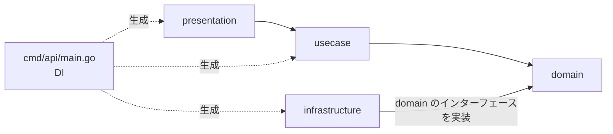

# バックエンドアーキテクチャ

`apps/api` は domain / usecase / infrastructure / presentation の 4 層構成。
目的は「業務ルールを、HTTP・DB・OpenAPI 生成コードから独立させて置ける場所を作ること」。

## 1. 依存の向き



- 内側（domain）は外側を**一切** import しない。
- infrastructure は domain の下位ではなく「domain が定義したインターフェースの実装」。
  これが依存性逆転で、DB を差し替えても domain / usecase は変更不要になる。
- 具象実装を選ぶのは `cmd/api/main.go` だけ（composition root）。

許可される import を表にすると次のとおり。

| 層 | import してよい | してはいけない |
| --- | --- | --- |
| domain | 標準ライブラリ、`uuid` のような値型 | 他の全層、`internal/openapi`、DB ドライバ |
| usecase | domain | `internal/openapi`、`net/http`、chi、DB ドライバ |
| infrastructure | domain（+ DB ドライバ等） | usecase、presentation、`internal/openapi` |
| presentation | usecase、domain（エラー判定）、`internal/openapi`、chi | infrastructure |

`internal/openapi`（生成物）は presentation 層だけが知る。
usecase 以下が生成型を使うと、仕様変更が業務ルールを壊すようになるため禁止。

## 2. ディレクトリ

```
apps/api/
  cmd/api/main.go                  起動・設定読み込み・DI・graceful shutdown
  internal/
    domain/todo/
      todo.go                      エンティティ、生成関数、ドメインルール
      errors.go                    ドメインエラー（ErrNotFound など）
      repository.go                Repository インターフェース（実装は infrastructure）
    usecase/todo/
      usecase.go                   ユースケース群（依存はインターフェースのみ）
      dto.go                       入出力の型（層をまたぐデータの受け渡し）
    infrastructure/memory/
      todo_repository.go           Repository のインメモリ実装（mutex + map）
    presentation/http/
      router.go                    chi、ミドルウェア、CORS、OpenAPI リクエスト検証
      handler.go                   openapi.StrictServerInterface の実装
      mapper.go                    domain / usecase の型 ⇄ 生成型の変換
      error.go                     エラー → HTTP ステータス + Error スキーマ
    openapi/                       生成物（api.gen.go）
```

ドメインを追加するときは `domain/<name>` / `usecase/<name>` / `infrastructure/<driver>` を並べる。
`internal/domain/todo` のようにドメインごとのパッケージにするのは、
パッケージ名が語彙になる（`todo.Todo`, `todo.Repository`）ため。

## 3. 各層の責務

### domain

- エンティティ / 値オブジェクトと、その不変条件（例: title は 1〜200 文字）。
- ドメインエラー（`errors.New` によるセンチネル、または独自型）。
- リポジトリのインターフェース。**呼ぶ側（内側）に置く**のが依存性逆転の要点。
- `time.Now()` や `uuid.New()` を直接呼ばず、必要なら引数で受け取る（テスト容易性のため）。

```go
// internal/domain/todo/todo.go
type Todo struct {
    ID        uuid.UUID
    Title     string
    Done      bool
    CreatedAt time.Time
}

func New(id uuid.UUID, title string, createdAt time.Time) (Todo, error) {
    title = strings.TrimSpace(title)
    if title == "" {
        return Todo{}, ErrEmptyTitle
    }
    // ...
}

// internal/domain/todo/repository.go
type Repository interface {
    List(ctx context.Context, filter Filter) ([]Todo, error)
    FindByID(ctx context.Context, id uuid.UUID) (Todo, error)
    Create(ctx context.Context, t Todo) error
    Delete(ctx context.Context, id uuid.UUID) error
}
```

### usecase

- ユースケース 1 個 = メソッド 1 個。「何をするか」の手順だけを書く。
- トランザクション境界はここ（1 ユースケース = 1 トランザクション）。
- ID 生成・現在時刻のような環境依存は、インターフェース / 関数値として注入する。

```go
type UseCase struct {
    repo  todo.Repository
    now   func() time.Time
    newID func() uuid.UUID
}

func (u *UseCase) Create(ctx context.Context, in CreateInput) (todo.Todo, error) {
    t, err := todo.New(u.newID(), in.Title, u.now().UTC())
    if err != nil {
        return todo.Todo{}, err
    }
    if err := u.repo.Create(ctx, t); err != nil {
        return todo.Todo{}, err
    }

    return t, nil
}
```

### infrastructure

- domain のインターフェースの実装。現状はインメモリ（`memory`）のみ。
- DB / 外部 API / メッセージングを足す場合もここにドライバ単位で追加し、
  `main.go` の結線を差し替える。他の層は変更しない。
- SQL や外部 API のエラーは、そのまま漏らさず domain のエラーに翻訳して返す
  （例: 行が無ければ `todo.ErrNotFound`）。

### presentation

- HTTP に関する全て: ルーティング、ミドルウェア（RequestID / ログ / Recoverer / CORS）、
  OpenAPI のリクエスト検証、生成された `StrictServerInterface` の実装。
- リクエスト → usecase の入力型、usecase の出力 → レスポンス生成型への変換。
- エラー → HTTP ステータスのマッピング。業務判断はここに書かない。

## 4. リクエストの流れ

```
POST /todos
  → chi ミドルウェア（RequestID / Logger / Recoverer / CORS）
  → OpenAPI リクエスト検証ミドルウェア（仕様違反は 400 で打ち返す）
  → 生成された strict handler（型付きの Request オブジェクトに変換）
  → presentation/http.Handler.CreateTodo
  → usecase/todo.UseCase.Create
  → domain/todo.New（不変条件の検査）
  → domain/todo.Repository.Create → infrastructure/memory
  → presentation でレスポンス生成型に変換して 201
```

仕様で表現できる制約（必須項目、型、`minLength` / `maxLength`、`format: uuid`）は
検証ミドルウェアが弾くので、ハンドラや usecase で再検証しない。
一方 domain の不変条件は「仕様の重複」ではなく最後の砦として持つ（HTTP 以外の入口が増えても効く）。

## 5. エラー設計

domain がエラーの語彙を持ち、presentation が HTTP に翻訳する。

| domain のエラー | HTTP | `Error.code` |
| --- | --- | --- |
| `todo.ErrNotFound` | 404 | `not_found` |
| `todo.ErrEmptyTitle` / `ErrTitleTooLong` | 400 | `invalid_argument` |
| （検証ミドルウェアが検出） | 400 | `invalid_request` |
| 上記以外 | 500 | `internal` |

- 判定は `errors.Is` / `errors.As`。文字列比較はしない。
- 層をまたぐときは `fmt.Errorf("...: %w", err)` でラップし、原因を失わない。
- レスポンスボディは常に OpenAPI の `Error` スキーマ（`code` / `message`）。
  500 の `message` に内部情報を載せない。

## 6. ユースケースを追加する手順

1. `openapi/openapi.yaml` に operation を追加する。
2. `task gen` → `StrictServerInterface` にメソッドが増え、コンパイルエラーになる。
3. domain に必要な型 / ルール / リポジトリメソッドを足す。
4. usecase にメソッドと入出力型を足す（テストはフェイクリポジトリで書く）。
5. infrastructure でリポジトリメソッドを実装する。
6. presentation でハンドラと変換・エラーマッピングを実装する。
7. `task lint test` を通す。

## 7. 判断の記録

- **`internal/` に置く**: 外部から import される想定がないため。公開ライブラリ化するときに考える。
- **strict server を使う**: 仕様を実装しない限りコンパイルが通らないという性質が、仕様ファーストの担保になる。
- **DTO を層ごとに分ける**: presentation が生成型を、usecase が入出力型を、domain がエンティティを持つ。
  変換コードは増えるが、仕様変更の影響範囲が presentation に閉じる。
- **リポジトリのインターフェースは domain に置く**（usecase ではなく）:
  リポジトリが扱うのはエンティティと集約の永続化であり、語彙は domain に属するため。
