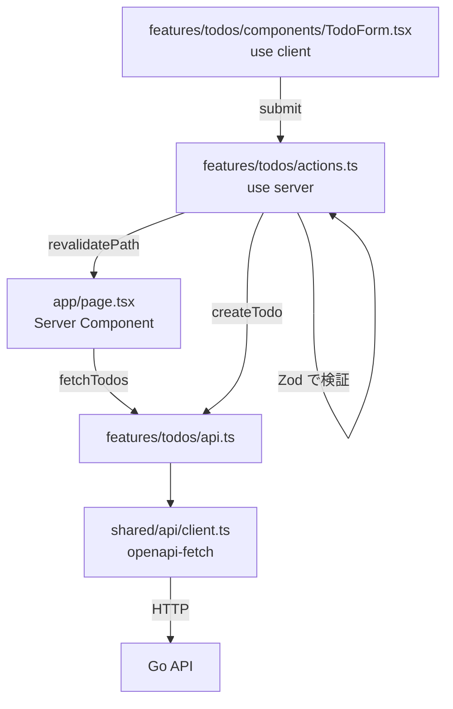

# フロントエンドアーキテクチャ

`apps/web` は Next.js 16 の App Router（SSR）。
コードは技術レイヤ（components / hooks / utils）ではなく **feature（機能）単位** で縦に切る。

## 1. ディレクトリ

```
apps/web/src/
  app/                       ルーティング専用（Server Component）
    layout.tsx
    page.tsx                 feature の公開 API を組み合わせるだけ
    globals.css
  features/
    todos/
      components/            TodoList.tsx / TodoForm.tsx / *.stories.tsx
      actions.ts             Server Actions（"use server"）
      api.ts                 shared/api のクライアント経由の API 呼び出し
      schema.ts              Zod スキーマ（+ そこから導く入力型）
      types.ts               feature 内で使う型（生成型の別名を含む）
      index.ts               公開 API（feature の外からはここだけを import）
  shared/
    api/
      client.ts              openapi-fetch の型付きクライアント
      schema.gen.ts          openapi-typescript の生成物（編集禁止）
    ui/                      複数 feature で使う汎用 UI
    lib/                     複数 feature で使う汎用ユーティリティ
```

## 2. ルール

1. **feature 間の直接 import を禁止。** 共有したくなったら `shared/` に上げるか、
   上位（`app/` のページ）で組み合わせる。
2. **feature の外からは `features/<name>` の `index.ts` 経由でのみ import する。**
   内部ファイルへの深い import はしない（公開範囲を index.ts で管理する）。
3. **`app/` にロジックを置かない。** `app/` はルーティング、メタデータ、
   feature のデータ取得の呼び出しと組み立てのみ。
4. **Server Component が既定。** `"use client"` は状態やイベントが必要な**葉**のコンポーネントだけに付ける
   （現状は `TodoForm` のみ）。
5. **生成型を再定義しない。** 型は `shared/api/schema.gen.ts` から取る。
   ```ts
   // features/todos/types.ts
   import type { components } from "@/shared/api/schema.gen";

   export type Todo = components["schemas"]["Todo"];
   ```
6. **Zod はユーザー入力の検証にだけ使う。** API レスポンスの再検証はしない
   （契約は OpenAPI と生成型が担保しており、二重管理になる）。
   Zod スキーマの制約は仕様（`CreateTodoRequest`）と一致させる。
7. **コンポーネントを追加したら同じディレクトリに `*.stories.tsx` を置く。**
8. **API 呼び出しは feature の `api.ts` に集約する。** コンポーネントから `apiClient` を直接呼ばない。

## 3. データの流れ



- 取得は Server Component から（`export const dynamic = "force-dynamic"` によりリクエストごとに SSR）。
- 更新は Server Action。クライアントに API のベース URL や認証情報を出さない。
- 更新後の再描画は `revalidatePath` で行い、クライアント側に一覧の状態を持たない。
- API 由来のエラーは `api.ts` で `Error` に変換し、Server Action が
  フォームの状態（`FormState.error`）として画面に返す。

## 4. Server Action の置き場所

Server Action は「feature の更新ユースケース」なので `features/<name>/actions.ts` に置く。
`app/` 側には置かない（ページが増えると重複するため）。

- Next.js の server-only API（`revalidatePath` / `cookies` / `redirect`）を使うのは
  この `actions.ts` のみ。`api.ts` はそれらに依存させない（Storybook / Vitest から使えるようにするため）。
- Client Component には action を **props で渡す**（`import` させない）。
  こうすると Storybook でモックした action を差し込めるので、UI が単体で動く。

## 5. feature を追加する手順

1. `features/<name>/` を作り、`components/` / `api.ts` / `actions.ts` / `schema.ts` / `types.ts` / `index.ts` のうち必要なものを置く。
2. 型は `shared/api/schema.gen.ts` から取り、入力検証は `schema.ts` の Zod スキーマで行う。
3. コンポーネントごとに story を書く（`play` で主要なインタラクションを 1 本）。
4. `index.ts` で外に出すものだけ export する。
5. `app/` にルートを追加し、feature を組み立てる。
6. `task lint test` を通す。E2E に影響するなら `task e2e` も実行する。
