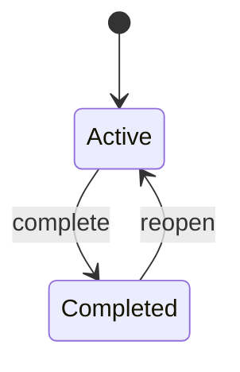

このファイルは、機能 / ドメイン単位で作成する仕様書のテンプレートです。
HTTP 契約は `openapi/openapi.yaml` を参照し、OpenAPI に書けない内容を記載します。

# <機能名> 仕様書

## 1. 概要
- 目的 / 解決する課題（3 行以内）
- 想定利用者とユースケース

## 2. スコープ
- やること
- やらないこと（今回対象外・将来対応）

## 3. 用語・ドメインモデル
| 用語 | 定義 | 対応する実装 |
| --- | --- | --- |
| Task | ... | `internal/domain/task` |

- エンティティの属性と不変条件（例: `title` は 1〜200 文字、前後空白はトリム）
- 識別子の生成規則（UUID v4 / サーバ生成）

## 4. 状態遷移

- 遷移が許されない組み合わせと、そのときのエラー

## 5. 業務ルール
| ID | ルール | 違反時の振る舞い |
| --- | --- | --- |
| BR-01 | タイトルは必須 | 400 `invalid_request` |
| BR-02 | 完了済みタスクは編集不可 | 409 `conflict` |

※ ID はテスト設計書から参照するので必ず振る。

## 6. インターフェース
### 6.1 API
OpenAPI の operationId を列挙するだけにする（定義は複製しない）。
| operationId | 概要 | 関連ルール |
| --- | --- | --- |
| `listTasks` | 一覧取得 | - |
| `createTask` | 作成 | BR-01 |

### 6.2 画面 / 操作
- 画面と URL、表示要素、操作と結果（成功時 / 失敗時の見え方）
- 空状態・ローディング・エラー表示の指定

## 7. エラー仕様
| コード | HTTP | 発生条件 | ユーザーへの表示 |
| --- | --- | --- | --- |
| `invalid_request` | 400 | 仕様違反の入力 | 入力欄下にメッセージ |
| `not_found` | 404 | 対象が存在しない | 一覧へ戻す |

## 8. 非機能要件
- 性能（例: 一覧 200 件で SSR 1s 以内）
- 可用性・データ保持（現状はインメモリなので再起動で消える等の制約）
- セキュリティ / 権限（ブラウザは API を直接叩かない、`API_BASE_URL` はサーバ専用）
- ログ・監査

## 9. 前提と未決事項
| # | 論点 | 暫定 | 決定期限 |

## 10. 変更履歴
| 日付 | 変更 | 対応 PR |
