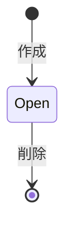

# Todo 仕様書

## 1. 概要
- Todo の作成・一覧・取得・削除を提供し、やることを管理する。
- API は OpenAPI、画面は Next.js の SSR と Server Action で提供する。

## 2. スコープ
- やること: Todo の作成、一覧、取得、削除、タイトル入力の検証。
- やらないこと: 完了操作、永続化、認証・複数ユーザー、一覧のページング。

## 3. 用語・ドメインモデル
| 用語 | 定義 | 対応する実装 |
| --- | --- | --- |
| Todo | `Todo{ID uuid.UUID, Title string, Done bool, CreatedAt time.Time}` | `apps/api/internal/domain/todo` |
| TitleMaxLength | タイトルの最大長。rune 数で 200 | `apps/api/internal/domain/todo` |

- `Title` は前後の空白をトリムし、空文字・空白のみを許可しない。
- `Done` は作成時に `false` とする。`ID` はサーバ生成 UUID、`CreatedAt` はサーバ時刻の UTC とする。
- usecase は `now func() time.Time` / `newID func() uuid.UUID` を受け取り、`WithClock` / `WithIDGenerator` でテスト時に固定できる。

## 4. 状態遷移

Done への遷移手段は未実装であり、完了に変更する API は存在しない。

## 5. 業務ルール
| ID | ルール | 違反時の振る舞い |
| --- | --- | --- |
| BR-01 | `title` は必須。trim 後に空（空文字 / 空白のみ）を許可しない | `ErrEmptyTitle` → HTTP 400 `invalid_argument` |
| BR-02 | 保存される `title` は前後の空白をトリムした値とする | トリム後の値を保存する |
| BR-03 | `title` の長さは rune 数で 200 まで。201 rune は許可しない | `ErrTitleTooLong` → HTTP 400 `invalid_argument` |
| BR-04 | `id` はサーバ生成 UUID、`createdAt` はサーバ時刻の UTC とする | usecase の注入点で生成する |
| BR-05 | `done` は作成時 `false`。完了に変更する API は存在しない | `GET /todos?status=done` は常に空配列 |
| BR-06 | 一覧は作成が古い順。`status` は `all`（default）、`open`（`done=false`）、`done`（`done=true`） | presentation の `doneFilter` で変換する |
| BR-07 | 存在しない id への `getTodo` / `deleteTodo` は対象なしとする | HTTP 404 `not_found` |
| BR-08 | UUID 形式でない path パラメータや仕様違反リクエストを受け付けない | OpenAPI 検証ミドルウェアが HTTP 400 `invalid_request` を返す |
| BR-09 | 同一 id の重複作成を許可しない | `ErrAlreadyExists` → HTTP 500 `internal` |

## 6. インターフェース
### 6.1 API
OpenAPI の operationId を列挙するだけにする（定義は複製しない）。
| operationId | 概要 | 関連ルール |
| --- | --- | --- |
| `getHealth` | ヘルスチェック | - |
| `listTodos` | Todo 一覧取得（`status` query） | BR-05, BR-06 |
| `createTodo` | Todo 作成 | BR-01, BR-02, BR-03, BR-04, BR-09 |
| `getTodo` | Todo 取得 | BR-07, BR-08 |
| `deleteTodo` | Todo 削除 | BR-07, BR-08 |

### 6.2 画面 / 操作
- `/` のみを提供し、`export const dynamic = "force-dynamic"` で SSR する。
- 見出しは `Todos` とする。
- `TodoForm` は入力の aria-label を「やること」、送信ボタンを「追加」とする。エラーは `role="alert"` と `data-testid="todo-form-error"` で表示する。
- `TodoList` は各行を `data-testid="todo-item"` で識別し、各行に「削除」ボタンを表示する。Todo が無い場合は空状態を表示する。
- 更新は Server Action `createTodoAction` / `deleteTodoAction` で行い、成功後に `revalidatePath("/")` を実行する。
- フロント側の入力検証は Zod の `createTodoSchema` で行う。メッセージは「タイトルを入力してください」/「200文字以内で入力してください」とする。
- `deleteTodoAction` は `todoId` が文字列でなければ何もしない。

## 7. エラー仕様
| コード | HTTP | 発生条件 | ユーザーへの表示 |
| --- | --- | --- | --- |
| `invalid_request` | 400 | 検証ミドルウェアが UUID 形式やリクエスト仕様の違反を検出 | 入力またはリクエストのエラー |
| `invalid_argument` | 400 | ドメイン規則（空タイトル、タイトル長超過）に違反 | 入力欄下にメッセージ |
| `not_found` | 404 | 指定した Todo が存在しない | 対象が存在しないことを表示 |
| `internal` | 500 | 同一 id の重複作成など、内部エラーが発生 | 共通エラー |

## 8. 非機能要件
- 性能: ページは毎リクエスト SSR（`force-dynamic`）で、API 呼び出しは 1 リクエストにつき一覧取得 1 回に収める。
- 可用性: API の read / write timeout は 15s、graceful shutdown は 10s とする。処理中のリクエストを打ち切らない。
- セキュリティ: ブラウザは Go API を直接呼ばず、必ず Next.js のサーバ側（Server Component / Server Action）を経由する。`API_BASE_URL` はサーバ専用で `NEXT_PUBLIC_` を付けない。
- 運用性: ログは slog の JSON で標準出力に出す。構造化ログとして収集できること。
- 可観測性: `getHealth` を liveness probe として提供する。

## 9. 前提・制約
- 永続化はインメモリ実装（`internal/infrastructure/memory`）で、プロセス再起動でデータが消える。複数インスタンスに水平スケールできない（インスタンス間でデータを共有しない）。
- 起動時に `"read the OpenAPI spec"` / `"run task dev"` の 2 件を seed する。開発・E2E の初期表示用であり、業務上の初期データではない。
- CORS の許可オリジンは `CORS_ALLOWED_ORIGINS`（既定 `http://localhost:3000`）。ブラウザから API を直接叩いてデバッグする場合の保険で、通常の経路では使わない。
- 認証・認可は無く、全 Todo が単一の共有リストとして見える。
- 上記の制約は永続化（未決事項 2）と認証（未決事項 3）の対応で外れる。

## 10. 未決事項
| # | 論点 | 暫定 | 決定期限 |
| --- | --- | --- | --- |
| 1 | 完了操作（`PATCH /todos/{todoId}` 等） | 未実装 | 未定 |
| 2 | 永続化（インメモリ → DB） | 未実装 | 未定 |
| 3 | 認証・複数ユーザー | 未対応 | 未定 |
| 4 | 一覧のページング | 未対応 | 未定 |

## 11. 変更履歴
| 日付 | 変更 | 対応 PR |
| --- | --- | --- |
| 2026-08-19 | 初版作成（既存実装からの追記） | PR #4 |
