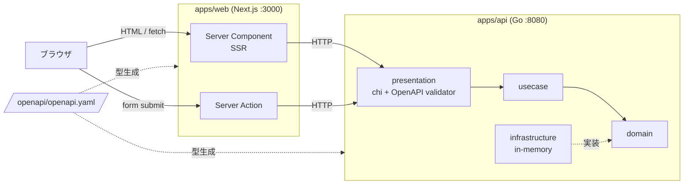
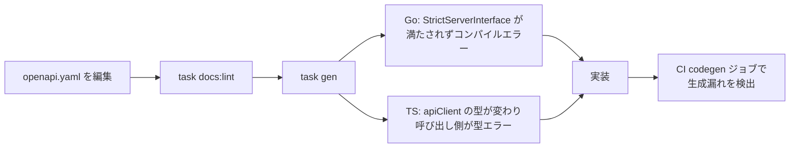

# システム概要書

## 1. 目的とスコープ

このリポジトリは **Next.js (SSR) + Go + OpenAPI 仕様ファースト** で業務システムを作るための土台。
題材の Todo は「基盤が実際に動くこと」を示すためのサンプルであり、
実プロダクトでは Todo を対象ドメインに差し替えて使う。

土台として保証したいこと:

- HTTP 契約は `openapi/openapi.yaml` の 1 ファイルだけが真実。フロント / バックの型は両方そこから生成する。
- 仕様と実装のズレはコンパイルエラーと CI で機械的に検出する（人のレビューに依存しない）。
- 層の責務が決まっており、ドメインが増えても構成が壊れない（[バックエンド](architecture/backend.md) / [フロントエンド](architecture/frontend.md)）。

対象読者: このリポジトリで開発する人 / コーディングエージェント。

## 2. 全体構成

ポイント:

- **ブラウザは Go API を直接叩かない。** データ取得は Server Component、更新は Server Action で、
  どちらもサーバ側から API を呼ぶ。したがって `API_BASE_URL` はサーバ専用の環境変数
  （`NEXT_PUBLIC_` を付けない）。
- API の CORS 設定は、Compose 等でブラウザから直接叩いてデバッグする場合の保険として残している。

## 3. コンポーネント

| パス | 役割 |
| --- | --- |
| `openapi/openapi.yaml` | HTTP 契約の単一の真実 |
| `apps/web` | Next.js 16 App Router（SSR / Server Actions）、Tailwind CSS 4、Storybook |
| `apps/api` | Go 1.26 API（chi + oapi-codegen strict server + OpenAPI リクエスト検証ミドルウェア） |
| `e2e` | Playwright。api / web を自動起動して主要フローを検証 |
| `docs` | 本ドキュメント群と Redocly の生成物（`docs/api/`） |
| `taskfiles` | `app.yml`（アプリ）/ `docs.yml`（OpenAPI）のタスク定義 |
| `docker-bake.hcl` / `compose.yaml` | 本番イメージのビルド（buildx bake）/ ローカル開発（ホットリロード） |
| `.github/workflows/ci.yml` | CI（frontend / backend / docs / codegen / docker / e2e） |

## 4. 技術スタック

| 領域 | 採用 |
| --- | --- |
| フロント | Next.js 16.3.1, React 19, TypeScript 5, Tailwind CSS 4 |
| 入力検証 | Zod 4 |
| UI カタログ | Storybook 10（`@storybook/nextjs-vite`, addon-a11y） |
| フロントのテスト | Vitest（ユニット）/ Storybook の `play`（インタラクション） |
| バックエンド | Go 1.26, chi v5, oapi-codegen v2, google/uuid, testify |
| 型生成 | Go: oapi-codegen / TS: openapi-typescript + openapi-fetch |
| Lint / Format | Biome 2（TS）, golangci-lint 2（Go）, Redocly CLI 2（OpenAPI） |
| E2E | Playwright 1.62 |
| タスクランナー | Task（Taskfile） |
| コンテナ | Docker マルチステージ + Buildx bake、Compose |

## 5. 仕様ファーストの開発フロー

生成物（`apps/api/internal/openapi/api.gen.go`, `apps/web/src/shared/api/schema.gen.ts`）は
手で編集しない。`task gen:check` が「仕様から再生成した結果」と差分がないことを検証する。

## 6. 実行方法

| 目的 | コマンド | 備考 |
| --- | --- | --- |
| ローカル開発 | `task dev` | api（air）:8080 + web（next dev）:3000 |
| Docker 開発 | `task app:docker:up` | ソースをバインドマウントしてホットリロード。api の healthcheck 成功後に web が起動 |
| 本番イメージ | `task app:docker:build` | マルチステージ + buildx キャッシュ。api は distroless、web は Next standalone |
| API ドキュメント | `task docs:build` / `task docs:preview` | Redoc の静的 HTML を `docs/api/api.html` に出力し :4000 で配信 |
| Storybook | `task app:storybook` | :6006 |

主な環境変数:

| 変数 | 対象 | 既定値 |
| --- | --- | --- |
| `API_BASE_URL` | web（サーバ側） | `http://localhost:8080` |
| `PORT` | api | `8080` |
| `CORS_ALLOWED_ORIGINS` | api | `http://localhost:3000` |

## 7. CI

| ジョブ | 守っているもの |
| --- | --- |
| frontend | Biome / 型 / Next ビルド / Storybook ビルド / Vitest |
| backend | golangci-lint / `go test -race` / ビルド |
| docs | OpenAPI の lint と、ドキュメント・bundle の生成可能性 |
| codegen | 生成物が仕様と同期していること |
| docker | 本番イメージがビルドできること |
| e2e | 主要ユーザーフローが動くこと |

詳細は[テスト方針](testing-policy.md)。

## 8. 現状の制約（実システム化するときの TODO）

このリポジトリは土台であり、以下は**意図的に未実装**。採用時に決めること。

- **永続化**: Todo はプロセス内メモリ。再起動で消える。DB を入れる場合は
  `infrastructure/` に実装を追加し、`cmd/api/main.go` の結線を差し替える（他の層は変更不要）。
- **認証 / 認可**: なし。OpenAPI にも `securitySchemes` を定義していないため、
  Redocly の `security-defined` ルールを off にしている。導入時は on に戻す。
- **可観測性**: 構造化ログ（slog）と chi のリクエストログのみ。メトリクス / トレーシングはなし。
- **その他**: レート制限、ページネーション、監査ログ、マイグレーション、
  複数環境向けの設定管理（現状は環境変数の直読み）はなし。
- **デプロイ**: イメージのビルドまで。レジストリへの push とデプロイ先は未定。
